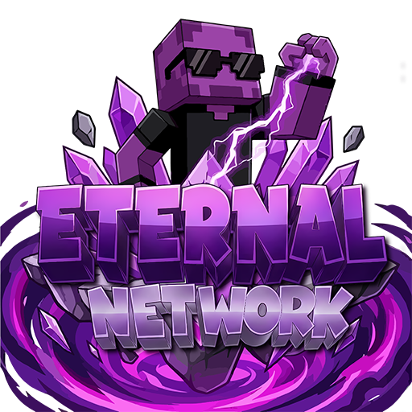

# 📖 Wiki de EternalSMP

<figure><figcaption></figcaption></figure>

### <mark style="color:#9000df;">¡Bienvenid@!</mark>

¿Necesitas ayuda para proteger tu hogar? ¿No sabes los comandos de SkyBlock e Survival? ¿Quieres enviar un mensaje privado a un jugador? \
El objetivo de esta guía es que puedas resolver todas tus dudas relacionadas con el servidor.&#x20;

En el **lado izquierdo** puedes encontrar un menú con diferentes apartados.

En la **parte superior** derecha tienes un buscador para agilizar tus dudas.

## <mark style="color:#9000df;">**¿Quiénes somos?**</mark>

Somos la comunidad de EternalSMP, donde podrás disfrutar de distintas modalidades junto a otros jugadores.

## <mark style="color:#9000df;">IP DEL SERVIDOR:</mark>

**JAVA:** eternalsmp.lat

**BEDROCK:** eternalsmp.lat — Puerto: 19132

¿No sabes entrar en bedrock? [Click aquí.](servidor/faq.md#como-se-entra-en-bedrock-al-servidor)

### <mark style="color:#9000df;">REDES DE ETERNALSMP</mark>

Nuestra web oficial: [¡Click aquí!](https://www.eternalsmp.lat)

Nuestro Discord oficial: [¡Click aquí!](https://discord.eternalsmp.lat)
