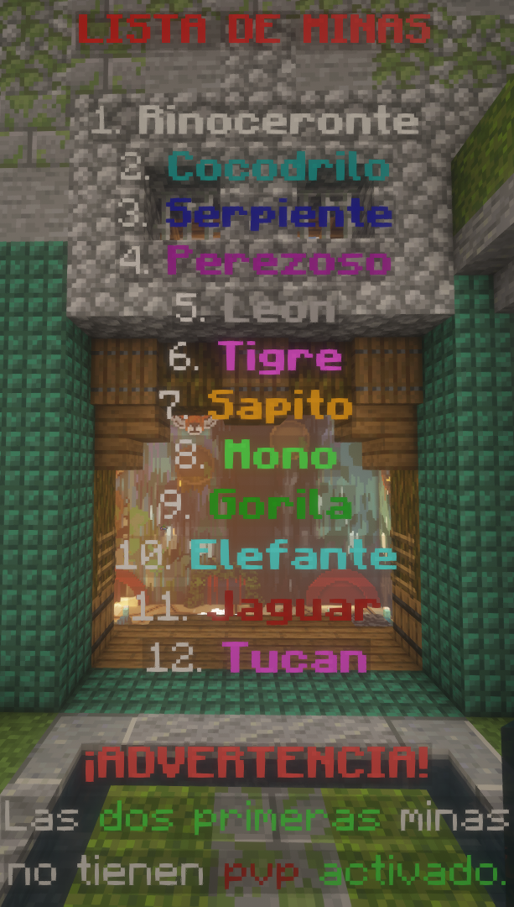

# 🌊 BoxPvP

## <mark style="color:#9000df;">¡COMENCEMOS!</mark>

Al ingresar a nuestra modalidad de **BoxPvP** te encontrarás con un spawn ambientado en una jungla, donde podrás ver y descubrir muchas cosas que te ayudarán al inicio de tu aventura. ¡Kits de pago, rangos, portales a diferentes lugares, cajas, tradeos y mucho más! Por lo tanto en esta guía, te ayudaremos con todo lo que necesitas saber para comenzar y poder convertirte en un verdadero aventurero.

⚠️ _Tanto en el **Spawn** como en las **minas 1 a la 2** el **PvP está desactivado**_

### <mark style="color:red;">⛏️</mark> <mark style="color:#9000df;">MINA INICIAL:  - El comienzo de nuestro viaje</mark> 

En primer lugar, debes dirigirte a la mina **INICIAL**, se encuentra justamente atrás de donde apareces, en esta mina deberás picar bloques de sangre, luego acercarte al saqueador que tiene de nombre Tradeo Items y podremos obtener una pieza de armadura, elytras, pico, espada y artefacto para nuestra mano secundaria.

<figure><figcaption>
Mina Inicial con PvP desactivado
</figcaption></figure>

### ⛏️ <mark style="color:#9000df;">**MINAS: de la 1 a la 12**</mark> 

Este viaje te llevará por las distintas minas disponibles, cada una de ellas más compleja que la anterior. Una vez conseguido todos los items de la mina Inicial deberemos seguir por el resto de las minas, obteniendo los bloques compactados e intercambiandolos con el compactador y el NPC correspondiente por el siguiente objeto, cada mina pide 1 bloque compactado más que el anterior.

El orden de las minas a las cuales debes dirigirte es el siguiente:

<figure><figcaption>
Minas de la 1 a la 2 con PvP desactivado
</figcaption></figure>

### **⛏️&#x20;**<mark style="color:#9000df;">**MINAS CÉNTRICAS: Orbes y Minerales**</mark> 

La economía de esta modalidad se basa en 5 puntos importantes: **Minerales - Orbes Lunares** - **Lunim** - **Espectrum - Lunaris**

En estas minas encontrarás minerales, los cuales te ayudarán a conseguir **Orbes Lunares**.

Las **minas de minerales**, las cuales están rodeando la estructura central, son con los que podrás cambiar por las orbes disponibles en la zona de tradeos, puedes dirigirse allí en el spawn.

En el medio se encuentra la **mina de Netherita**, con los bloques podrás conseguir **Netherite Compressed** y canjearlos por **Lunim**.

<figure><figcaption>
Minas céntricas
</figcaption></figure>

### **🫴&#x20;**<mark style="color:#9000df;">**TRADEOS**</mark> 

La zona de tradeos se encuentra en la parte derecha del spawn apenas ingresas a la modalidad. La misma cuenta con 8 tradeos diferentes en este momento:

* 💎**Minerales:** Aquí podrás cambiar los orbes conseguidos en las minas centrales, obteniendo minerales como el **Orbes Lunares**, el **Lunim**, el **Espectrum**, entre otros, con los cuales podrás tradear con el resto de los aldeanos.
* 🏺**Elixires:** Donde podrás conseguir diferentes **pociones** que te **potenciarán** y ayudarán en el juego.
* 📦**Shulker:** Donde podrás conseguir cajas que te ayuden a transportar tus objetos.
* 🛠️**Herramientas:** Aquí conseguirás items como tijeras, arcos, huesos, entre otros.
* 🏹**Variado:** Con los tradeos en esta zona conseguirás cohetes, totems, telas de arañas, flechas, etc.

<figure><figcaption>
Tradeos
</figcaption></figure>

### **📦&#x20;**<mark style="color:#9000df;">**CAJAS**</mark> 

Justo a la izquierda del Spawn nos encontramos con la **zona de cajas** las cuales se abren solo con llaves que podes conseguir de otras cajas, en eventos, votando por el servidor o comprándolas en la tienda.

<figure><figcaption>
Cajas
</figcaption></figure>

### **🥅&#x20;**<mark style="color:#9000df;">**PORTALES**</mark> 

Cuando ingresas a la modalidad, te encontrarás con 2 portales.

🎊 **Portal Zona Tops:** Como su nombre lo especifica, aquí encontrarás a los mejores usuarios en cada Item (Kills, Koths Wins, Votos, etc.).

⏳**Portal AFK:** En este lugar podrás quedarme AFK y **ganar items** de forma pasiva.

<figure><figcaption>
Zona AFK
</figcaption></figure> <figure><figcaption>
Zona de Tops
</figcaption></figure>


Cualquier bug de la modalidad por favor, repórtalo en [discord](https://discord.lostaroleros.com).\
\
Siempre recordamos el uso de bugs o aprovechar de ellos es sancionable.

