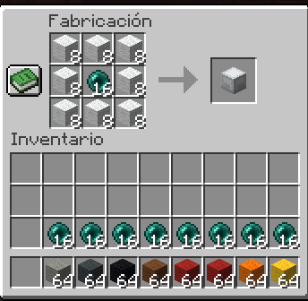
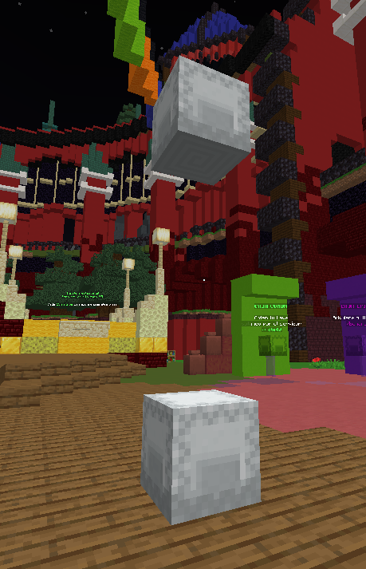

# 🔋 Elevadores

## <mark style="color:blue;">¿Como se craftea?</mark>

Requieres 8 lanas y 1 enderpearl.

Si quieres de colores, puedes usar las lanas de colores y servira el crafteo.

## <mark style="color:blue;">¿Como se usa?</mark>

Debes de ponerlo asi:

